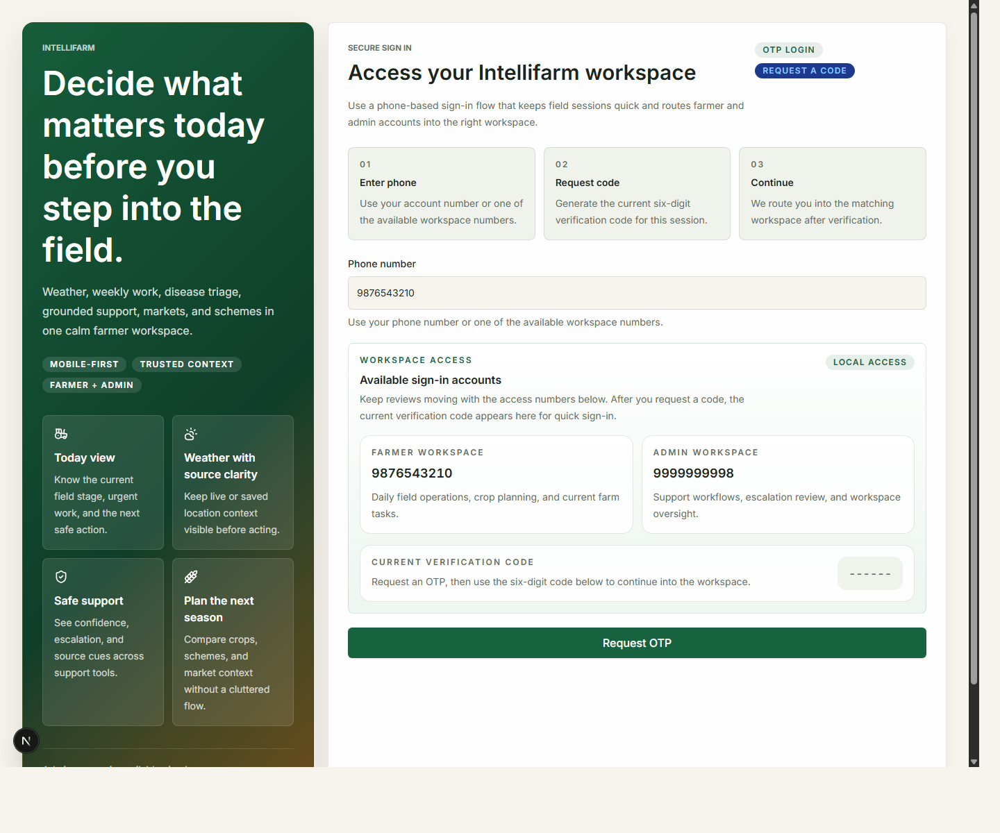
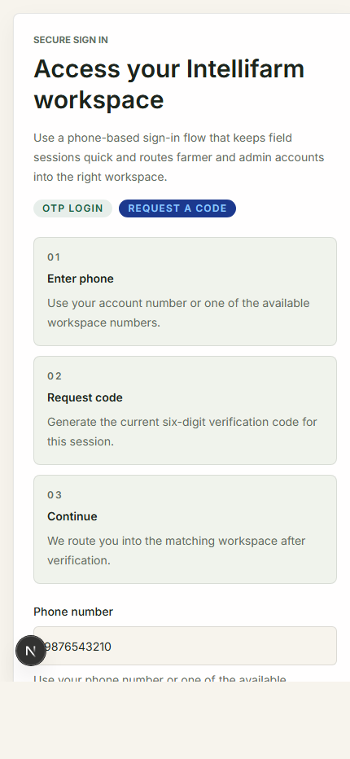

# Intellifarm

An India-first farmer platform — a crop-season copilot that helps smallholder farmers plan, decide, and act. Built as a `pnpm` + Turborepo monorepo with a NestJS backend as the single source of truth, a Next.js web app, an Expo mobile app, and shared type-safe contracts.

> **Status:** active hackathon project being hardened for production. The full stack runs on mock/seeded providers out of the box — no external API keys required to demo.

## What it does

- **Phone OTP auth** and farmer profile onboarding
- **Farm plot + crop season** setup with a deterministic crop rules engine and timeline
- **Weekly dashboard** — tasks, alerts, and live weather
- **Grounded AI assistant** (text + voice) that answers using *your* saved farm data, rules, weather, markets, and schemes
- **Dual-angle disease reporting** with escalation-first triage
- **Location-aware mandis & warehouses** with best-price callouts
- **Government schemes** with crop-aware filters
- **IoT pump control** — ESP32 telemetry ingest with a two-step, confirmation-gated pump command flow
- Lightweight internal **admin** view

## Architecture

```
                    ┌──────────────────┐      ┌──────────────────┐
                    │   Web (Next.js)  │      │  Mobile (Expo)   │
                    │   React 19 :3000 │      │  React Native    │
                    └────────┬─────────┘      └────────┬─────────┘
                             │   REST /v1 + cookies     │  REST /v1 + WS /voice
                             └────────────┬─────────────┘
                                          ▼
                              ┌───────────────────────┐
                              │   API (NestJS) :4000   │
                              │  REST · Swagger /docs  │
                              │  WebSocket /voice      │
                              │  helmet · throttler    │
                              └───────────┬───────────┘
                                          │ Prisma
                                          ▼
                              ┌───────────────────────┐
                              │   PostgreSQL           │
                              └───────────────────────┘
                                          ▲
              pluggable providers (env-selected) ─ markets · disease · assistant
              external: Open-Meteo · Gemini · Data.gov · ML/disease HTTP services

   ESP32 node ──POST /v1/devices/ingest (x-device-key)──▶ API
```

`packages/contracts` (Zod schemas + enums) is the shared contract imported by the API and every client. See **[CLAUDE.md](./CLAUDE.md)** for detailed development conventions.

## Tech stack

| Layer | Stack |
| --- | --- |
| Monorepo | Turborepo + pnpm workspaces, Node 24 |
| Web | Next.js 16 App Router, React 19, Tailwind 4, SWR |
| Mobile | Expo / React Native 0.81, Expo Router, EAS Build |
| API | NestJS 11, REST, Swagger, WebSockets (`ws`) |
| Database | PostgreSQL + Prisma |
| Auth | Phone OTP → JWT in secure HTTP-only cookies |
| Contracts | Zod schemas shared across API + clients |

## Workspace layout

```text
apps/
  api/        NestJS REST API  (@intellifarm/api)
  web/        Next.js web app  (@intellifarm/web)
  mobile/     Expo mobile app  (@intellifarm/mobile)
packages/
  contracts/  shared Zod schemas + enums  (@intellifarm/contracts)
  config/     shared TS/Prettier config
iot/
  esp32/      Arduino firmware for the sensor/pump node
```

Each app has its own README: [api](./apps/api/README.md) · [web](./apps/web/README.md) · [mobile](./apps/mobile/README.md).

## Quick start

### Option A — Docker (one command)

Spins up Postgres + API + web together:

```bash
docker compose up --build
# once the API is healthy, seed demo data:
docker compose exec api ./node_modules/.bin/prisma migrate deploy
docker compose run --rm api pnpm --filter @intellifarm/api db:seed
```

- Web: http://localhost:3000
- API: http://localhost:4000 · Swagger: http://localhost:4000/docs

### Option B — Local dev

```powershell
corepack enable
pnpm install

# configure environment (DATABASE_URL + JWT secrets are required)
Copy-Item .env.example .env

# apply migrations and seed demo content
pnpm db:deploy
pnpm db:seed

# run web + api + contracts watcher in parallel
pnpm dev
```

Default URLs: web `http://localhost:3000`, API `http://localhost:4000`, Swagger `http://localhost:4000/docs`.

> The required env vars are validated at API startup — a missing `DATABASE_URL`, `JWT_ACCESS_SECRET`, or `JWT_REFRESH_SECRET` fails fast with a clear message.

### Demo login

| Role | Phone | OTP |
| --- | --- | --- |
| Farmer (seeded farm + crops) | `9876543210` | `123456` |
| Admin (`/admin` access) | `9999999998` | `123456` |

## Commands

Run from the repo root (Turborepo fans out to workspaces):

```powershell
pnpm dev          # web + api + contracts watcher, all in parallel
pnpm build        # build all workspaces
pnpm lint         # eslint across workspaces
pnpm typecheck    # tsc --noEmit across workspaces
pnpm test         # jest (api)

pnpm db:generate  # prisma generate
pnpm db:migrate   # prisma migrate dev (local DBs)
pnpm db:deploy    # prisma migrate deploy (managed/pooled DBs)
pnpm db:seed      # demo farmer, admin, crops, mandis
```

Single API test: `pnpm --filter @intellifarm/api test -- devices.service.spec`

## Provider configuration

The app runs fully on **mock/seeded providers by default**. Live providers are opt-in via env vars (see `.env.example` for the full list):

| Domain | Mode var | Live config |
| --- | --- | --- |
| Markets / mandi prices | `MARKET_PROVIDER_MODE` (`seeded` \| `scraper` \| `live`) | `DATA_GOV_API_KEY`, `DATA_GOV_RESOURCE_ID` |
| Disease analysis | `DISEASE_PROVIDER_MODE` (`mock` \| `live`) | `DISEASE_PROVIDER_URL`, `DISEASE_PROVIDER_API_KEY` |
| AI assistant | — | `GEMINI_API_KEY`, `AI_ASSISTANT_MODEL` |
| Weather | always live (Open-Meteo) | `OPEN_METEO_BASE_URL` |

All clients use the same backend routes, auth, and data models regardless of provider mode.

## Deployment

- **Web** → Vercel (`vercel.json` builds contracts first). Set `NEXT_PUBLIC_API_URL`.
- **API** → Fly.io (`apps/api/fly.toml`) or any Docker host (`apps/api/Dockerfile`). Set `DATABASE_URL`, `JWT_ACCESS_SECRET`, `JWT_REFRESH_SECRET` as secrets. `/health` checks DB connectivity for load-balancer probes.
- **Database** → any managed Postgres (Neon, Supabase, RDS). Run `prisma migrate deploy` on release (the API image does this on boot).
- **CI** → `.github/workflows/ci.yml` runs lint/typecheck/test/build and builds both Docker images on every PR.

## Documentation & presentation

- **[CLAUDE.md](./CLAUDE.md)** — development conventions and architecture
- **[docs/](./docs/README.md)** — user-flow diagrams, pitch slides, poster, and the [voice assistant spec](./docs/voice-assistant.md)
- **Swagger / OpenAPI** — `http://localhost:4000/docs` when the API is running

### Screenshots

| Login (desktop) | Login (mobile) |
| --- | --- |
|  |  |

## Notes

- Crop/resource prediction is advisory and provider-backed — there is no in-repo trained model.
- Disease analysis stays escalation-first and avoids blind chemical prescriptions.
- Assistant answers are grounded in saved farm data, not open-ended agronomy guarantees.
- Pump control is confirmation-gated end to end (device API and voice assistant alike).
