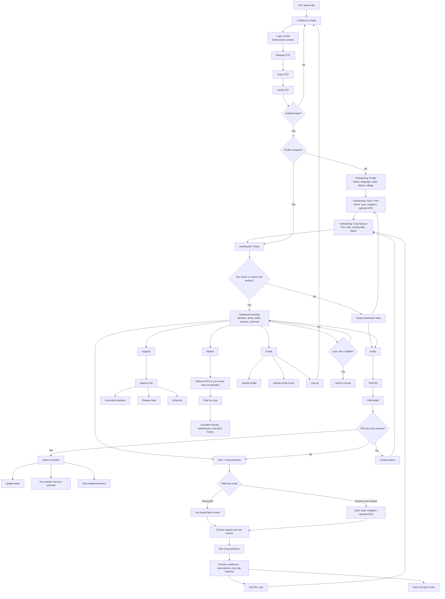
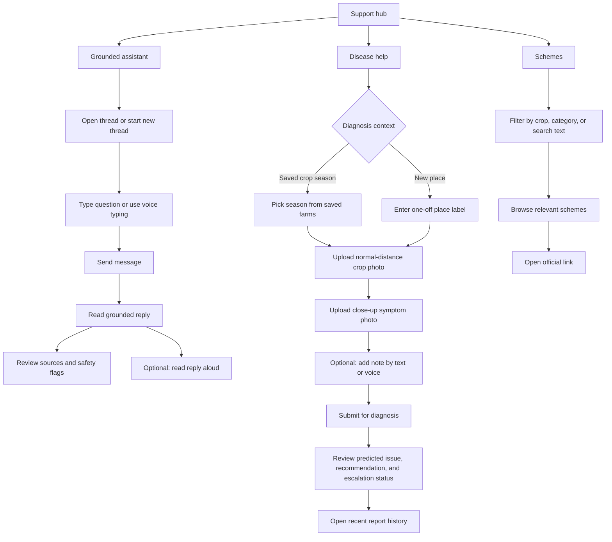
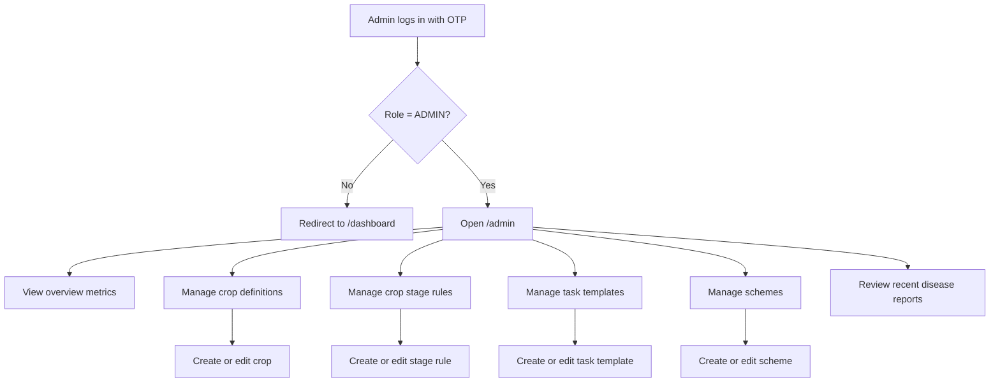

# Intellifarm User Flow Diagram

This diagram reflects the current implemented flow in the app.

For a hackathon-friendly presentation version, open [userflow-hackathon.html](/C:/Pranav/Development/Hackathon/Intellifarm/intellifarm-rebuid/docs/userflow-hackathon.html).

Additional presentation assets:

- [Poster-style hackathon diagram](/C:/Pranav/Development/Hackathon/Intellifarm/intellifarm-rebuid/docs/userflow-poster.html)
- [Single-slide pitch HTML](/C:/Pranav/Development/Hackathon/Intellifarm/intellifarm-rebuid/docs/userflow-pitch-slide.html)
- [Judge-friendly swimlane HTML](/C:/Pranav/Development/Hackathon/Intellifarm/intellifarm-rebuid/docs/userflow-swimlane.html)
- [Pitch slide SVG](/C:/Pranav/Development/Hackathon/Intellifarm/intellifarm-rebuid/docs/exports/userflow-pitch-slide.svg)
- [Pitch slide PNG](/C:/Pranav/Development/Hackathon/Intellifarm/intellifarm-rebuid/docs/exports/userflow-pitch-slide.png)
- [Swimlane SVG](/C:/Pranav/Development/Hackathon/Intellifarm/intellifarm-rebuid/docs/exports/userflow-swimlane.svg)
- [Swimlane PNG](/C:/Pranav/Development/Hackathon/Intellifarm/intellifarm-rebuid/docs/exports/userflow-swimlane.png)

## Overview Flow

## Support And Advisory Flows

## Admin Flow

